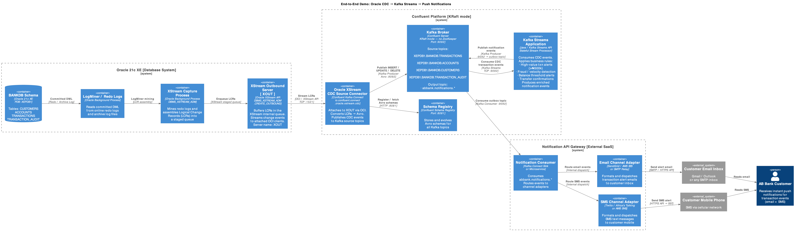

# Oracle 21c XStream CDC → Confluent Platform E2E Demo

Real-time capture of customer bank-account transactions from **Oracle 21c XE** using the
**Confluent Oracle XStream CDC Source Connector**, streaming events through a **fully
self-hosted Confluent Platform (KRaft mode)** running in Docker.



## Use Case

The use case is to provide real-time visibility into customer account activity. Every `INSERT`,
`UPDATE`, and `DELETE` on the `TRANSACTIONS` table (and related tables) in Oracle is
captured the instant it is committed and published to Kafka.

Tables captured:

| Schema.Table | Description |
|---|---|
| `BANKDB.CUSTOMERS` | Customer master data |
| `BANKDB.ACCOUNTS` | Bank accounts (savings, current, …) |
| `BANKDB.TRANSACTIONS` | Debit/Credit transactions |
| `BANKDB.TRANSACTION_AUDIT` | Audit trail of high-value transactions |

---

## Prerequisites

| Tool | Minimum Version | Notes |
|---|---|---|
| Docker Desktop / Docker Engine | 24.x | Needs ≥ 8 GB RAM allocated |
| Docker Compose | v2.x (`docker compose`) | Bundled with Docker Desktop |
| `curl` + `jq` | any | For REST API calls |
| Oracle XStream CDC Connector ZIP | latest GA | See §3 below |
| Oracle Instant Client | 19.x or 21.x | Matching your host architecture |

> **Memory**: The stack (Oracle + Kafka + Connect) needs roughly
> **6–8 GB** of available RAM. On Docker Desktop go to **Settings → Resources** and
> set Memory to at least **8 GB**.

---

## Quick Start (5 Steps)

### Step 1 – Clone / Download

```bash
git clone <this-repo>
cd abbank-cdc-demo
```

### Step 2 – Add Connector & Oracle Instant Client

The Confluent Oracle XStream CDC Source Connector is a **licensed, GA connector**.
You must download it from [Confluent Hub](https://www.confluent.io/hub/) or your
Confluent account portal.

```
connect/
└── confluent-hub-components/
    └── confluentinc-kafka-connect-oracle-xstream-cdc/   ← unzip connector here
        ├── lib/
        │   ├── kafka-connect-oracle-xstream-cdc-*.jar
        │   ├── ojdbc8.jar          ← copy from Instant Client download
        │   └── xstreams.jar        ← copy from Instant Client download
        └── ...
```

Download the Oracle Instant Client for **your architecture**:

* **Linux x86-64** – `instantclient-basic-linux.x64-19.26.0.0.0dbru.zip`
* **Linux ARM64 / Apple Silicon (via Rosetta)** – `instantclient-basic-linux.arm64-19.26.0.0.0dbru.zip`

from https://www.oracle.com/database/technologies/instant-client/downloads.html

Unzip it so the directory ends up at:

```
connect/instantclient/   (contains libclntsh.so, etc.)
```

The `Dockerfile` in `connect/` already handles copying this into the Connect image.

### Step 3 – Configure Environment

Copy the example env file and fill in any overrides you need:

```bash
cp .env.example .env
```

The defaults work out of the box for a local laptop demo — no changes required unless
you want to adjust ports.

### Step 4 – Start the Stack

```bash
# Pull base images and build the custom Connect image (~5 min first time)
docker compose build

# Start everything (Oracle takes ~3–4 min to become ready)
docker compose up -d

# Follow Oracle startup logs
docker compose logs -f oracle
# Wait for: "DATABASE IS READY TO USE!"
```

### Step 5 – Run the Demo Script

The helper script will:
1. Wait for all services to be healthy
2. Configure the Oracle XStream Outbound Server
3. Deploy the CDC Source Connector
4. Generate live transaction data

```bash
chmod +x scripts/demo.sh
./scripts/demo.sh
```

Then open:

| UI | URL | Credentials |
|---|---|---|
| Confluent Control Center | http://localhost:9021 | (none) |
| Kafka Connect REST | http://localhost:8083 | (none) |
| Schema Registry | http://localhost:8081 | (none) |

---

## Detailed Walkthrough

### Oracle Database Setup

Oracle 21c XE starts and runs the init scripts in `oracle/scripts/` automatically:

1. `01_setup_archivelog.sql` – Enables archivelog mode, creates XStream admin user `c##ggadmin`
2. `02_create_schema.sql` – Creates `BANKDB` user with all banking tables
3. `03_create_xstream_outbound.sql` – Creates the XStream Capture and Outbound Server `XOUT`
4. `04_seed_data.sql` – Seeds reference data (customers, accounts)

Check Oracle is ready:

```bash
docker exec -it oracle sqlplus sys/Oracle21c!@XE as sysdba <<'EOF'
SELECT STATUS FROM V$INSTANCE;
SELECT CAPTURE_NAME, STATUS FROM ALL_XSTREAM_OUTBOUND WHERE SERVER_NAME = 'XOUT';
EOF
```

### Kafka Connect

The custom `connect/Dockerfile`:
- Extends `confluentinc/cp-server-connect`
- Installs the Oracle Instant Client
- Sets `LD_LIBRARY_PATH` to point at the Instant Client libs
- Copies all connector JARs from `connect/confluent-hub-components/`

Check Connect is healthy:

```bash
curl -s http://localhost:8083/ | jq .version
curl -s http://localhost:8083/connector-plugins/ | jq '.[].class' | grep -i oracle
```

### Deploy the CDC Source Connector

The connector config lives at `connect/connectors/oracle-xstream-cdc.json`.  
The demo script deploys it automatically, but you can do it manually:

```bash
curl -s -X POST -H 'Content-Type: application/json' \
  --data @connect/connectors/oracle-xstream-cdc.json \
  http://localhost:8083/connectors | jq

# Check status
curl -s http://localhost:8083/connectors/ABBANK-XSTREAM-CDC/status | jq
```

Topics created automatically:

```
XEPDB1.BANKDB.CUSTOMERS
XEPDB1.BANKDB.ACCOUNTS
XEPDB1.BANKDB.TRANSACTIONS
XEPDB1.BANKDB.TRANSACTION_AUDIT
__cflt-oracle-heartbeat.XEPDB1
__orcl-schema-changes.XEPDB1
```

### Generate Live Transactions

The `scripts/generate_transactions.sh` script runs continuously, inserting, updating
and occasionally deleting transactions:

```bash
./scripts/generate_transactions.sh
```

Or run an individual SQL session:

```bash
docker exec -it oracle sqlplus bankdb/BankDB2024!@XEPDB1 @/opt/oracle/scripts/startup/05_live_transactions.sql
```

---

## Connector Lifecycle Commands

```bash
# Pause CDC connector (transactions buffer in Oracle redo logs)
curl -s -X PUT http://localhost:8083/connectors/ABBANK-XSTREAM-CDC/pause | jq

# Resume
curl -s -X PUT http://localhost:8083/connectors/ABBANK-XSTREAM-CDC/resume | jq

# Stop (KIP-875 - CP 7.6+)
curl -s -X PUT http://localhost:8083/connectors/ABBANK-XSTREAM-CDC/stop | jq

# Restart
curl -s -X POST http://localhost:8083/connectors/ABBANK-XSTREAM-CDC/restart | jq

# Delete
curl -s -X DELETE http://localhost:8083/connectors/ABBANK-XSTREAM-CDC | jq

# Tail logs
docker compose logs -f connect
```

---

## Monitoring XStream in Oracle

```bash
docker exec -it oracle sqlplus c##ggadmin/Confluent12!@XE
```

```sql
-- Is the outbound server attached?
SELECT SERVER_NAME, STATE FROM V$XSTREAM_OUTBOUND_SERVER;

-- Capture latency
SELECT CAPTURE_NAME,
       ROUND((SYSDATE - CAPTURE_MESSAGE_CREATE_TIME)*86400, 2) LATENCY_SEC
FROM V$XSTREAM_CAPTURE;

-- Throughput
SELECT SERVER_NAME,
       TOTAL_TRANSACTIONS_SENT,
       TOTAL_MESSAGES_SENT,
       ROUND(BYTES_SENT/1024/1024, 2) MB_SENT
FROM V$XSTREAM_OUTBOUND_SERVER;

-- Sessions
SELECT ACTION, SID, SERIAL#, PROCESS FROM V$SESSION WHERE MODULE='XStream';
```

---

## Teardown

```bash
# Stop everything and remove volumes
docker compose down -v

# Remove built Connect image
docker rmi abbank-connect:latest
```

---

## Troubleshooting

| Symptom | Fix |
|---|---|
| Oracle never shows "DATABASE IS READY TO USE!" | Increase Docker memory to 10 GB+ |
| Connect shows `ORA-01031: insufficient privileges` | Re-run `03_create_xstream_outbound.sql` as sysdba |
| `libclntsh.so: cannot open shared object` | Verify `connect/instantclient/` exists and matches container arch |
| Connector status `FAILED` with `xstreams.jar` error | Ensure `xstreams.jar` + `ojdbc8.jar` are in connector `lib/` folder |
| Topics not created | Check `auto.create.topics.enable=true` in broker config |

---

## Project Structure

```
oracle-xstream-cdc-connector-e2e-demo/
├── docker-compose.yml              # Full stack definition
├── README.md                       # This file
├── abbank-c4-diagram.puml          # Architecture diagram (PlantUML)
│
├── docs/                           # Documentation
│   ├── OPERATIONS.md               # Operational guide
│   └── TROUBLESHOOTING.md          # Detailed troubleshooting
│
├── oracle/
│   └── scripts/
│       ├── 00_enable_archivelog.sh # Helper to enable archivelog
│       ├── 01_setup_archivelog.sql # Archivelog + XStream admin user
│       ├── 02_create_schema.sql    # BANKDB schema + tables
│       ├── 03_create_xstream_outbound.sql  # XStream outbound server
│       ├── 04_seed_data.sql        # Initial customers + accounts
│       └── 05_live_transactions.sql # Continuous transaction generator
│
├── connect/
│   ├── Dockerfile                  # Custom Connect image with Instant Client
│   └── connectors/
│       └── oracle-xstream-cdc.json # CDC Source Connector config
│   └── confluent-hub-components/   # ← YOU ADD THE CONNECTOR ZIP HERE
│   └── instantclient/              # ← YOU ADD ORACLE INSTANT CLIENT HERE
│
├── monitoring/
│   └── jmx-exporter-config.yml     # JMX exporter config for Connect metrics
│
└── scripts/
    ├── demo.sh                     # Full end-to-end demo runner
    ├── generate_transactions.sh    # Continuous transaction generator
    ├── deploy_connectors.sh        # Connector deployment helper
    └── xstream_monitor.sh          # XStream health checker
```
